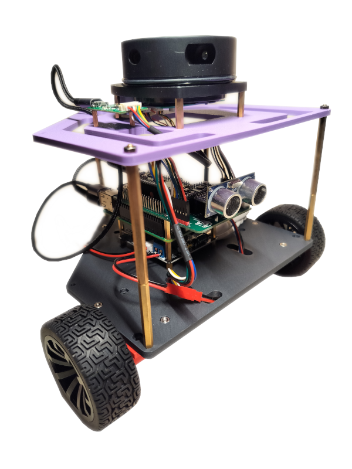

# Meet HomeR

**Home(plate)R(obot)** is an open-source mobile robot platform.
HomeR is designed for educational purposes with emphases on autonomous **SLAM** and **navigation**.
It features a differential drive mobile base regulated by a **Raspberry Pi Pico** microcontroller.
A **Raspberry Pi** SBC plays high-level decision making.
And the Robot Operating System (ROS) serves as the butler.
All the hardware components are easy to access or 3d printable.

## Key Specifications

| Features | Details |
| :--- | :--- |
| **Dimensions** | 180 x 180 x 180 |
| **Microcontroller** | Raspberry Pi Pico 2 (RP2350) |
| **MicroPython Firmware** | 1.27.0 |
| **Computer** | Raspberry Pi 5 (4GB) |
| **Operating System** | Ubuntu 24.04 |
| **Robot Manager** | ROS2 Jazzy |
