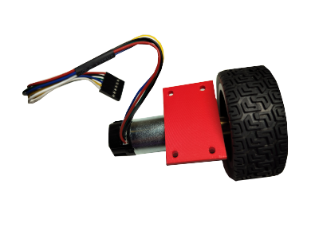
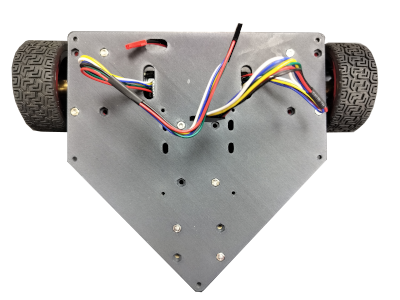
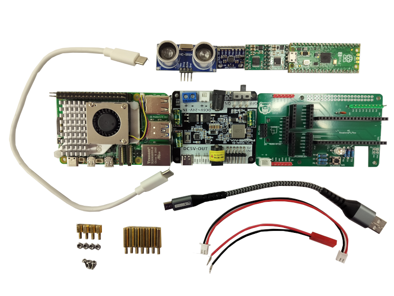

# R1B Assembly Guide

## 1 Wheel Assembly

### 1.1 Preparation
- 1x motor holder (3d printable)
- 1x 25mm diameter DC motor
- 2x M3x10mm screw
- 1x 4mm bore hex motor shaft coupler
- 1x M4x6mm screw (and washer)
- 1x 65mm diameter wheel/tire

### 1.2 Post Assemble
!!! warning "Motor Wires"
    Make sure motor wires sticking out from the same side as the flat surface of the motor holder

You will need to assemble 2 wheels.

## 2 Base Assembly

### 2.1 Preparation
- 1x base (3d printable)
- 1x caster wheel (3d printable)
- 2x wheel assembly
- 1x battery holder
- 2x M3x35mm screw (double them to offer extra security to the caster wheel)
- 4x M3x10mm screw (double them to offer extra security to the wheel assemblies)
- 2x M3x6mm screw (double them to offer extra security to the battery holder)
- 8x M3 screw (double them if screw numbers are doubled)

### 2.2 Post Assemble

!!! tip "Bottom View"

!!! tip "Top View"

## 3 Electronics Stack

### 3.1 Preparation
- 1x Power expansion board
- 1x Raspberry Pi 5
- 1x HomeR Thalamus board (relay)
- 1x Raspberry Pi Pico 2
- 1x GY-521 IMU module
- 1x HC-SR04 ultrasonic module
- 2x Pololu DRV8874 motor driver carrier
- 1x caster wheel (3d printable)
- 2x wheel assembly
- 1x battery holder
- 7x M2.5x16mm M-F standoff (use 8 if extra security is needed)
- 4x M2.5x6mm M-F standoff
- 3x M2.5x6mm screw (use 4 if 8 M2.5x16mm standoff were used)
- 4x M2.5 nut
- 1x 2-Pin cable with JST-RCY female connector
- 1x 2-Pin cable with JST-RCY female connector
- 1x 2-Pin cable with JST-XH2.54 male connector on one end
- 1x 2-Pin cable with JST-XH2.54 male connector on both ends
- 1x Micro-USB cable (data capable)
- 1x USB-C to USB-C cable (data not required)

