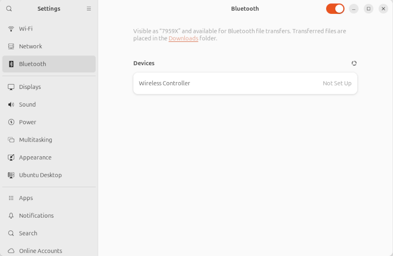

# Set Up Bluetooth Gamepad

If you have a bluetooth gamepad as shown in the picture below, you can connect it either by a graphical interface or command line interface.

## (Graphical) Connection via System Settings

### 1. Enter System Settings

Press `Super`/`WIN`/`Cmd` key or left click the top-right corner of the Ubuntu desktop to bring out the system search bar.
Search "bluetooth" then left-click to enter the `Bluetooth` page in the `Settings` interface.




### 2. Start Pairing

On gamepad, press and **hold** down the `HOME` and the `SHARE` button together, until the gamepads's LED starting to make **double blinks** pattern.
The double blinking pattern indicates the gamepad has entered the pairing mode.
The connectable gamepad will be appearing in the `Devices` list, named as "Wireless Controller".

!!! warning
    If the user release the `SHARE` button too quick or only pressed down the `HOME` button, the LED will make single blinks and the user will not be able to view/connect the gamepad.
    Wait for the single blinking to be stopped by itself, then try again by pressing and **holding** down the `HOME` and the `SHARE` button together.


### 3. Connect Bluetooth Device

Left-click the "Wireless Controller" and wait the device's status turned into "Connected".
The LED on the gamepad will be staying stabled on.


## (CLI) Connection via Command Line

There are chances your RPi is running in the headless mode (no monitor attached).
And you can connect to a bluetooth device through the command line tool: `bluetoothctl`

### 1. Remote Log In

In a terminal window on Host Machine, use `ssh` to log into RPi.

``` sh
ssh <username>@<ip_address>
```

### 2. Start Pairing

press and **hold** down the `HOME` and the `SHARE` button together, until the gamepads's LED starting to make **double blinks** pattern.

### 3. `bluetoothctl` Usage

1. In the remote terminal type: `bluetoothctl`. You'll notice the command prompt changed to `[bluetooth]#`.
2. Enter `scan on` to start discovering all the bluetooth devices nearby.
3. The gamepad ready for pairing should be listed as `[NEW] Device <MAC_address> Wireless Controller`.
4. Enter `pair <MAC_address>` to pair and auto connect to the bluetooth gamepad (You can use `tab` to autocomplete the `<MAC_address>`).
5. Enter `exit` or simply press `Ctrl+d` to quit `bluetoothctl` interface.

## Assign User account to `input` Group

ROS 2 needs to access the bluetooth gamepad under `/dev/input`.
Our user account is unlikely having the permission to visit such a location, because the default Ubuntu installation did not assign the `$USER` account to the `input` group.
We have to enter following command in a terminal then **reboot** the computer.

``` sh
sudo usermod -aG input $USER
```

After reboot, we can check if `$USER` is assigned to `input` by command:

``` sh
groups
# you'll end up getting something like:
# <username> adm sudo ... input
```

You can verify gamepad's availability using a ROS command:

``` sh
ros2 run joy joy_enumerate_device
```
