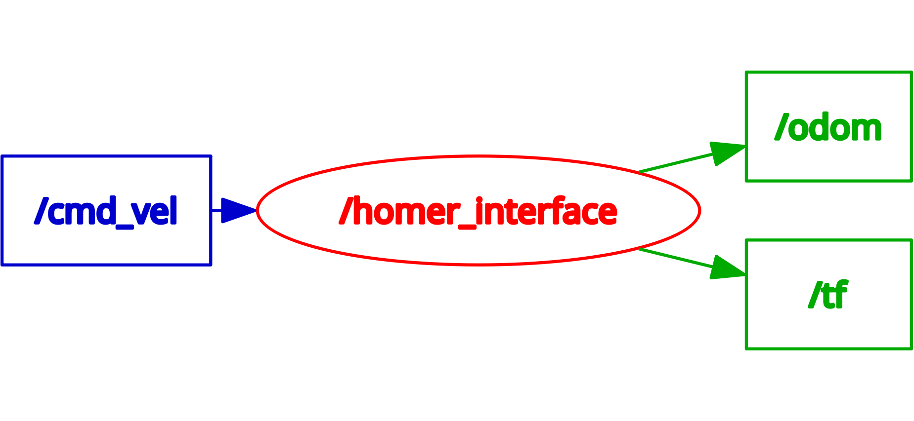
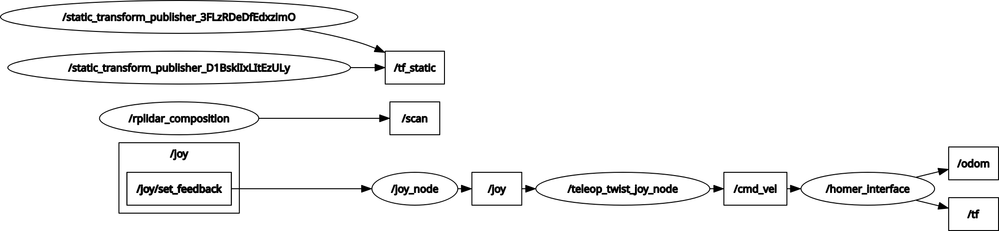

# Install and use `homer_bringup` package on Raspberry Pi

[`homer_bringup`](https://github.com/linzhanguca/homer_bringup) is a ROS 2 package for interfacing HomeR's hardware.

- [`homer_bringup`](https://github.com/linzhanguca/homer_bringup) is featured the [`homer_interface`](https://github.com/linzhangUCA/homer_bringup/blob/main/homer_bringup/homer_interface.py) node.
The node does the following jobs.

  - Sets up the communication between RPi and Pico.
  - Subscribes to the `/cmd_vel` topic and transfer the `linear.x` and `angular.z` values to Pico as the reference velocity for HomeR.
  - Publishes HomeR's motion status using [`Odometry`](https://docs.ros2.org/foxy/api/nav_msgs/msg/Odometry.html) message under the `/odom` topic.
  - Broadcasts dynamic transformations between the body frame: `base_link` and the global frame: `odom`.

The ROS functionalities of such a node is illustrated as the graph showing below.



- [`homer_bringup`](https://github.com/linzhanguca/homer_bringup) provides [`homer.launch.py`](https://github.com/linzhangUCA/homer_bringup/blob/main/launch/homer.launch.py) for the convenience to launch a collection of useful nodes and frame transformations alongside the `homer_interface` node.
The launch file's duties are listed below.
  - A `teleop_twist_joy_node` from the [`teleop_twist_joy`](https://index.ros.org/p/teleop_twist_joy/#jazzy) package, which publishes the `/cmd_vel` topic.
  - A customized `rplidar_composition` node (from [`rplidar_ros`](https://index.ros.org/p/rplidar_ros/#jazzy) package) publishing the `/scan` topic.
  - A static transformation between `base_link` frame and `lidar_link` frame (will be used for SLAM later).
  - A static transformation between the `base_link` frame and `base_footprint` frame (will be used for navigation later).

The launch file will construct a more complex system as the graph showing below.



## Create a Workspace

```bash
mkdir -p ~/homer_ws/src
```

## Install `homer_bringup` Package

```bash
cd ~/homer_ws/src
git clone https://github.com/linzhanguca/homer_bringup.git
cd ~/homer_ws
colcon build
source install/local_setup.bash
```

!!! tip
    You may add `source ~/homer_ws/install/local_setup.bash` to the end of `~/.bashrc` file, so that the `homer_bringup` will be always available.

## Usage

- To only start the `homer_interface` node:

```bash
ros2 run homer_bringup homer_interface
```

- To launch a collection of nodes

```bash
ros2 launch homer_bringup homer.launch.py
```

!!! tip
    You can start driving HomeR using a gamepad if using `ros2 launch ...` command.

- Test drive with keyboard

Open a separate terminal window (can be one on the server):

```bash
ros2 run teleop_twist_keyboard teleop_twist_keyboard
```
