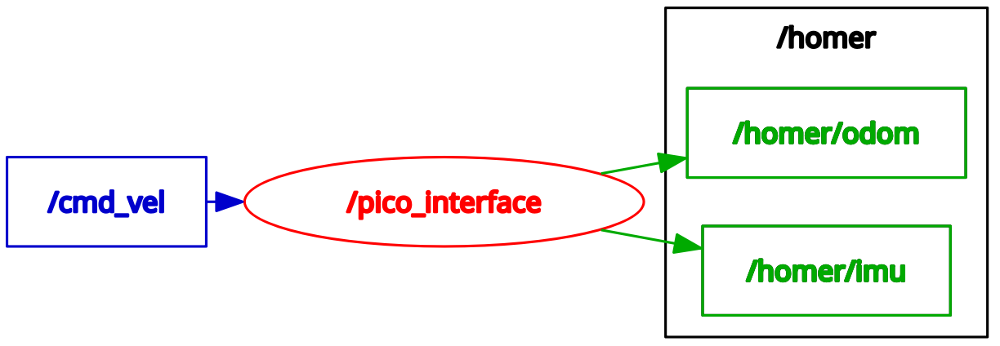

# Install and use `homer_bringup` package on Raspberry Pi

[`homer_bringup`](https://github.com/linzhanguca/homer_bringup) is a ROS 2 package for interfacing HomeR's hardware.

!!! success
    Setting up this package on **RPi** only.


## Install `homer_bringup` Package

```sh
mkdir -p ~/homer_ws/src  # create a workspace
cd ~/homer_ws/src  # navigate into `src/` under the workspace
git clone https://github.com/linzhanguca/homer_bringup.git  # download package
cd ~/homer_ws  # navigate to workspace root
rosdep install -y --from-paths src --ignore-src --rosdistro $ROS_DISTRO  # let `rosdep` install missing dependencies
colcon build  # build all packages in workspace
source ~/homer_ws/install/local_setup.bash  # register all resources in the current workspace
echo "source ~/homer_ws/install/local_setup.bash" >> ~/.bashrc  # auto register
```

!!! tip
    adding `source ~/homer_ws/install/local_setup.bash` to the end of `~/.bashrc` file, so that the `homer_bringup` will be always available.

## Usage

- To only start the `homer_interface` node:

```sh
ros2 run homer_bringup pico_interface
```


- To launch a collection of nodes

```sh
ros2 launch homer_bringup homer_launch.py
```

!!! tip
    You can start driving HomeR using a gamepad if using `ros2 launch ...` command.


- Test drive with keyboard

Open a separate terminal window (can be one on the server):

```sh
ros2 run teleop_twist_keyboard teleop_twist_keyboard
```


## Debriefing

### `pico_interface`
The core of [`homer_bringup`](https://github.com/linzhanguca/homer_bringup) package is the [`pico_interface`](https://github.com/linzhangUCA/homer_bringup/blob/main/homer_bringup/pico_interface.py) node which bridges the gap between the motion control and ROS management.
It does the following jobs.

- Sets up the communication between RPi and Pico.
- Subscribes to the ROS topic: `/cmd_vel` and transmits `linear.x` and `angular.z` values to Pico as the reference/target linear and angular  velocity for HomeR.
- Receives HomeR's motion status including the estimated linear and angular velocity based on the encoder data, accelerometer data (acceleration on 3 axes) and gyroscope data (angular velocity on 3 axes).
- Constantly updates HomeR's pose using the encoder estimated linear and angular velocity.
- Publishes [`Odometry`](https://docs.ros2.org/foxy/api/nav_msgs/msg/Odometry.html) message under the `/homer/odom` topic, which contains the pose and velocity information.
- Publishes [`Imu`](https://docs.ros2.org/foxy/api/sensor_msgs/msg/Imu.html) message under the `/homer/imu` topic, which contains the data from the MPU6050 sensor.

The duties of `pico_interface` node can be illustrated by the following graph



### `homer_launch.py`
[`homer_bringup`](https://github.com/linzhanguca/homer_bringup) provides [`homer_launch.py`](https://github.com/linzhangUCA/homer_bringup/blob/main/launch/homer_launch.py) for the convenience to launch a collection of useful nodes and frame transformations alongside the `pico_interface` node.
The launch file's duties are listed below.

- A `teleop_twist_joy_node` from the [`teleop_twist_joy`](https://index.ros.org/p/teleop_twist_joy/#jazzy) package, which publishes the `/cmd_vel` topic.
- A customized `rplidar_composition` node (from [`rplidar_ros`](https://index.ros.org/p/rplidar_ros/#jazzy) package) publishing the `/scan` topic.
- A static transformation between `base_link` frame and `lidar_link` frame (will be used for SLAM later).
- A static transformation between the `base_link` frame and `base_footprint` frame (will be used for navigation later).
- A static transformation between the `base_link` frame and `imu_link` frame.
- An Extended Kalman Filter node from [`robot_localization`](https://github.com/cra-ros-pkg/robot_localization) package to fuse the encoder data and the IMU data. This node spits out more accurate pose estimation and broadcast the transformations between the `odom` frame and the `base_link` frame.

The launch file will construct a more complex system.
Use `rqt_graph` command to view it.
